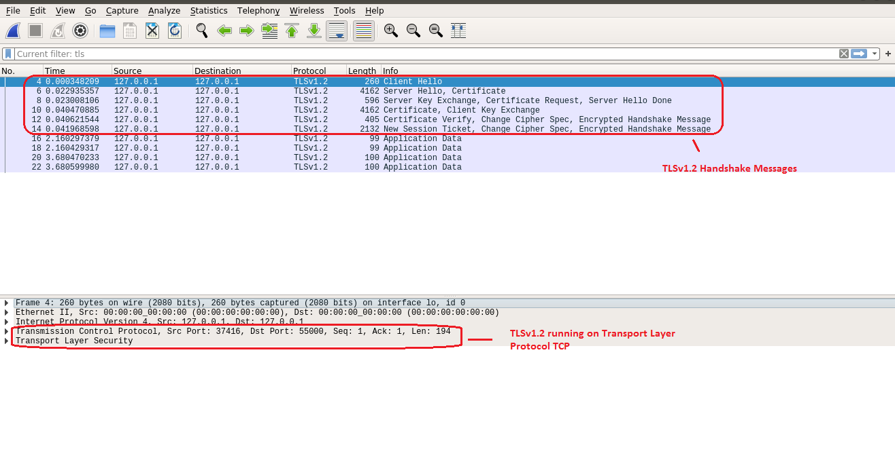
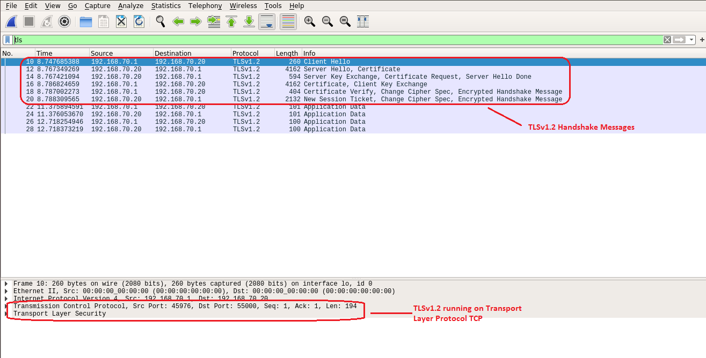
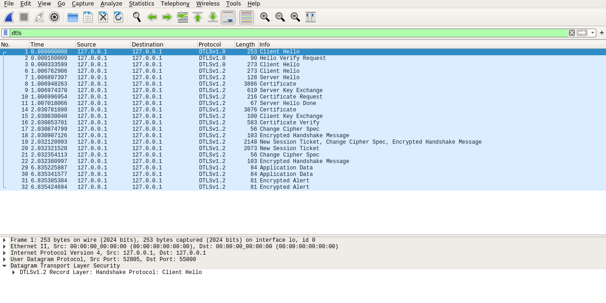
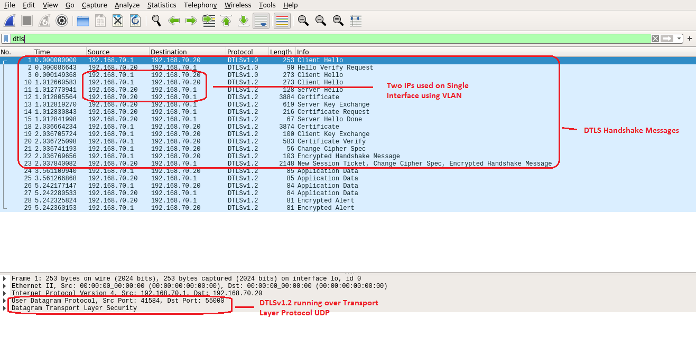

# Wireshark Captures

This document contains Wireshark captures for better understanding of the (D)TLS concepts viz. TLS Handshake, DTLS Handshake, TLS packet format, DTLS packet format etc.

## Transport Layer Security

The primary goal of the TLS protocol is to provide privacy and data integrity between two communicating applications.  The protocol is composed of two layers: the TLS Record Protocol and the TLS Handshake Protocol.  At the lowest level, layered on top of some reliable transport protocol (e.g., TCP), is the TLS Record Protocol.

The TLS Record Protocol provides connection security that has two basic properties:
  * Private connection (Cryptography is used for data encryption)
  * Reliable connection (Message Integrity Check)

The TLS Handshake Protocol, allows the server and client to authenticate each other and to negotiate an encryption algorithm and cryptographic keys before the application protocol transmits or receives its first byte of data. It provides connection security that has three basic properties:
  * Peer's identity can be authenticated using asymmetric, or public key, cryptography
  * Negotiation of a shared secret is secure
  * Negotiation is reliable

Figure 1 and figure 2 shows the message flow between TCP server and TCP client in blocking mode and non-blocking mode respectively with TLS Security enabled running on the same machine with Loopback IP (127.0.0.1) address.

Figure 1: TCP Server and TCP Client Communication on Loopback IP address in Blocking Mode with TLS

**[To be uploaded soon]**

Figure 2: TCP Server and TCP Client Communication on Loopback IP address in Non-Blocking Mode with TLS

Also, we can show communication between TCP Server and TCP Client with TLS Security enabled running on same machine but having different IP addresses with the help of VLAN.

Figure 3: TCP Server and TCP Client Communication with two different IP addresses in Blocking Mode with TLS

**[To be uploaded soon]**

Figure 4: TCP Server and TCP Client Communication with two different IP addresses in Non-Blocking Mode with TLS

## Datagram Transport Layer Security

The basic design philosophy of DTLS is to construct "TLS over datagram transport".  The reason that TLS cannot be used directly in datagram environments is simply that packets may be lost or reordered. TLS has no internal facilities to handle this kind of unreliability; therefore, TLS implementations break when rehosted on datagram transport.

The purpose of DTLS is to make only the minimal changes to TLS required to fix this problem.  To the greatest extent possible, DTLS is identical to TLS.  Whenever we need to invent new mechanisms, we attempt to do so in such a way that preserves the style of TLS. Therefore, DTLS is used over connectionless User Datagram Protocol (UDP).

Figure 5 and figure 6 shows the message flow between UDP server and UDP client in blocking mode and non-blocking mode with DTLS security enabled respectively running on the same machine with Loopback IP (127.0.0.1) address.

Figure 5: UDP Server and UDP Client Communication on Loopback IP address in blocking mode with DTLS

**[To be uploaded soon]**

Figure 6: UDP Server and UDP Client Communication on Loopback IP address in non-blocking mode with DTLS

Also, we can show communication between UDP Server and UDP Client with DTLS security enabled running on same machine but having different IP addresses with the help of VLAN.

Figure 7: UDP Server and UDP Client Communication with two different IP addresses in blocking-mode with DTLS

**[To be uploaded soon]**

Figure 8: UDP Server and UDP Client Communication with two different IP addresses in blocking-mode with DTLS
