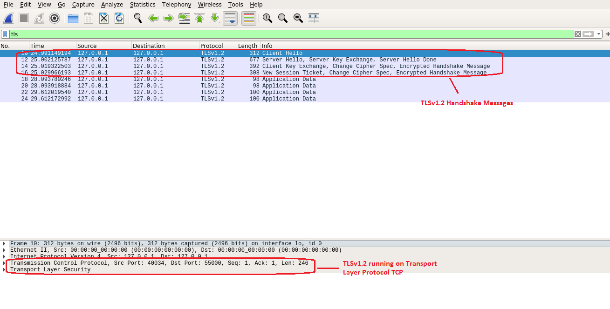
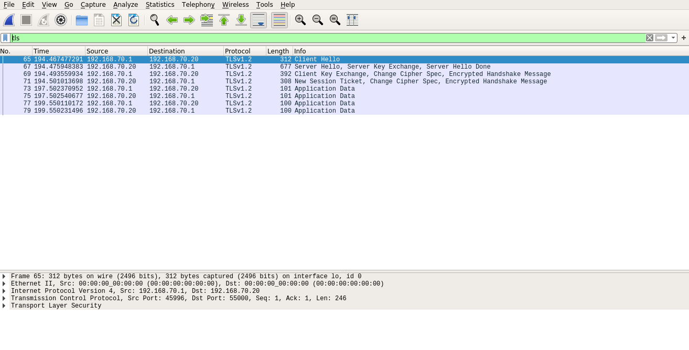
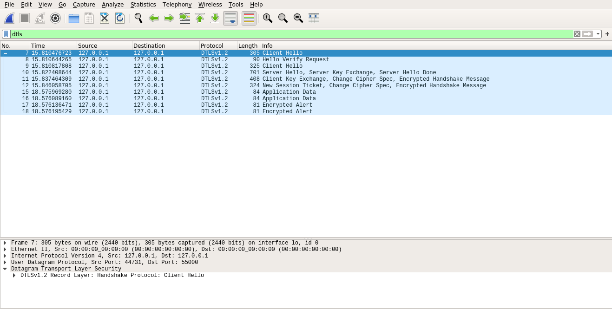
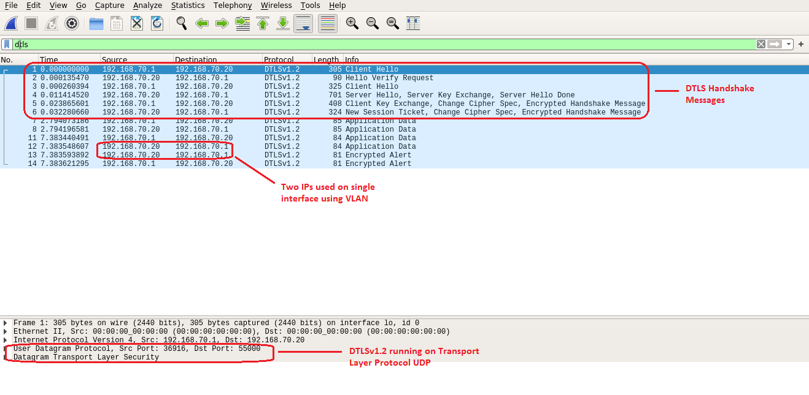

# Wireshark Captures

This document contains Wireshark captures for better understanding of the (D)TLS concepts viz. TLS Handshake, DTLS Handshake, TLS packet format, DTLS packet format etc.

## Transport Layer Security (TLS)

The primary goal of the TLS protocol is to provide privacy and data integrity between two communicating applications.  The protocol is composed of two layers: the TLS Record Protocol and the TLS Handshake Protocol.  At the lowest level, layered on top of some reliable transport protocol (e.g., TCP), is the TLS Record Protocol.

The TLS Record Protocol provides connection security that has two basic properties:
  * Private connection (Cryptography is used for data encryption)
  * Reliable connection (Message Integrity Check)

The TLS Handshake Protocol, allows the server and client to authenticate each other and to negotiate an encryption algorithm and cryptographic keys before the application protocol transmits or receives its first byte of data. It provides connection security that has three basic properties:
  * Peer's identity can be authenticated using asymmetric, or public key, cryptography
  * Negotiation of a shared secret is secure
  * Negotiation is reliable

To establish device identification and authentication and trust following methods can be used:
  * Certificates (x509): 
	Certificates are agreements between communicating parties and a common entity called a Certificate Authority (CA). The CA is a trusted entity that manages and issues security certificates to requesters to
	prove their identities and public keys that are used for secure communication. Mutual trust is established when communicating parties exchange certificates signed by a common CA.

  * Pre-Shared Key (PSK):
	Pre-Shared keys (PSK) are used to provide identity based on keys shared in advance among the communicating parties. This represents a more manual method of authentication and typically
	implemented in small systems.

Figure 1 and figure 2 shows the message flow between TCP server and TCP client in blocking mode and non-blocking mode respectively with TLS Security enabled using x509 certificates running on the same machine with Loopback IP (127.0.0.1) address.

Figure 1: TCP Server and TCP Client Communication on Loopback IP address in Blocking Mode with TLS using x509 certs

**[To be uploaded soon]**

Figure 2: TCP Server and TCP Client Communication on Loopback IP address in Non-Blocking Mode with TLS using x509 certs

Also, we can show communication between TCP Server and TCP Client with TLS Security enabled using x509 certificates running on same machine but having different IP addresses with the help of VLAN.

Figure 3: TCP Server and TCP Client Communication with two different IP addresses in Blocking Mode with TLS using x509 certs

**[To be uploaded soon]**

Figure 4: TCP Server and TCP Client Communication with two different IP addresses in Non-Blocking Mode with TLS using x509 certs

The secure TCP communication between server and client with PSK is shown in the figure 5 and figure 6.

Figure 5: TCP Server and TCP Client Communication on Loopback IP address in Blocking Mode with TLS using PSK

Figure 6: TCP Server and TCP Client Communication with two different IP addresses in Blocking Mode with TLS using PSK

## Datagram Transport Layer Security (DTLS)

The basic design philosophy of DTLS is to construct "TLS over datagram transport".  The reason that TLS cannot be used directly in datagram environments is simply that packets may be lost or reordered. TLS has no internal facilities to handle this kind of unreliability; therefore, TLS implementations break when rehosted on datagram transport.

The purpose of DTLS is to make only the minimal changes to TLS required to fix this problem.  To the greatest extent possible, DTLS is identical to TLS.  Whenever we need to invent new mechanisms, we attempt to do so in such a way that preserves the style of TLS. Therefore, DTLS is used over connectionless User Datagram Protocol (UDP).

Figure 7 and figure 8 shows the message flow between UDP server and UDP client in blocking mode and non-blocking mode with DTLS security enabled using x509 certificates respectively running on the same machine with Loopback IP (127.0.0.1) address.

Figure 7: UDP Server and UDP Client Communication on Loopback IP address in blocking mode with DTLS using x509 certs

**[To be uploaded soon]**

Figure 8: UDP Server and UDP Client Communication on Loopback IP address in non-blocking mode with DTLS using x509 certs

Also, we can show communication between UDP Server and UDP Client with DTLS security enabled using x509 certificates running on same machine but having different IP addresses with the help of VLAN.

Figure 9: UDP Server and UDP Client Communication with two different IP addresses in Blocking Mode with DTLS using x509 certs

**[To be uploaded soon]**

Figure 10: UDP Server and UDP Client Communication with two different IP addresses in non-blocking mode with DTLS using x509 certs

The secure UDP communication between server and client with PSK is shown in the figure 11 and figure 12.

Figure 11: UDP Server and UDP Client Communication on Loopback IP address in Blocking Mode with DTLS using PSK

Figure 12: UDP Server and UDP Client Communication with two different IP addresses in Blocking Mode with DTLS using PSK
